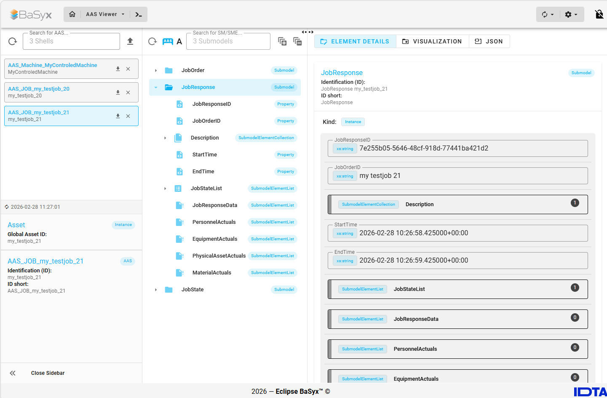

# OPC for Machinery to AAS Client

What this program does (in simple terms):
- It connects to a machine's OPC UA server.
- It listens for specific machine/job events.
- When a matching event arrives, it extracts relevant job information.
- It sends that information to create/update an Asset Administration Shell (AAS)
    representation via the BaSyx APIs.

Why this is useful:
- OPC UA is used by machines to expose data and events.
- AAS is a standardized digital representation of an asset (for example, a machine
    or a job) so IT systems can consume it consistently.
- This script acts as a translator/bridge: machine events in, AAS updates out.

## Basyx



## OPC UA Event Subscription Flow

In `main.py`, the client currently performs the following steps to find and process relevant events:

1. Connect to the OPC UA server using `UA_ENDPOINT_URL` and `UA_REQUEST_TIMEOUT`.
2. Load type definitions (`load_data_type_definitions`, `load_type_definitions`) and read the namespace array (`get_namespace_array`).
3. Resolve namespace indices from the namespace array for
	- `http://opcfoundation.org/UA/Machinery/`
	- `http://opcfoundation.org/UA/Machinery/Jobs/`
4. Enter via the configured machine instance `UA_MACHINE_INSTANCE_NODEID` (normalized using the helper `make_nodeid_string(...)`).
5. Navigate the address space:
	- `Machine -> MachineryBuildingBlocks -> JobManager -> JobOrderResults`
6. Read `GeneratesEvent` references from `JobOrderResults`.
7. Use the first reference as expected event type (`event_type_nodeid`) and resolve the event type node.
8. Create a subscription with `UA_PUBLISHING_INTERVAL`.
9. Subscribe with a server-side filter via `subscribe_events(...)`:
	- `sourcenode=job_order_results_node`
	- `evtypes=[found_eventtype_node]`
	- `where_clause_generation=True`
10. Process events continuously via queue:
	- `SubscriptionHandler` puts incoming events into `EVENT_QUEUE`.
	- `process_event(...)` only processes events whose `EventType` matches the previously determined event type.
	- The event field dictionary is forwarded to `create_aas_for_job(...)` (mapping into AAS payloads happens in `ua_job_aas.py`).

Event filtering is already done server-side in the subscription; client-side `EventType` checking remains as an additional safeguard.

## Features

- OPC UA connectivity via `asyncua`
- Event subscription
- AAS and submodel creation/update via BaSyx REST APIs
- Fully configurable via environment variables

## Requirements

- Python 3.11+ (recommended)
- Docker + Docker Compose (for local BaSyx backend)

## Quickstart

### 1) Start BaSyx backend (local)

```bash
cd backend
docker compose up -d
```

The following services are available by default:

- AAS Environment: http://localhost:8081
- AAS Registry: http://localhost:8082
- Submodel Registry: http://localhost:8083
- AAS Discovery: http://localhost:8084
- Dashboard API: http://localhost:8085
- AAS Web UI: http://localhost:3000


### 2) Start client via Docker image (GHCR)

The client image is available at:

`ghcr.io/andreasheine/ua4machinery2aas-client:main`

Run with the provided compose file:

```bash
docker compose up -d
```

or directly:

```bash
docker run --rm \
	--add-host=host.docker.internal:host-gateway \
	-e AAS_ENV_BASE_URL=http://host.docker.internal:8081 \
	-e AAS_ENV_REPO_PATH=http://host.docker.internal:8081/shells \
	-e SUBMODEL_ENV_REPO_PATH=http://host.docker.internal:8081/submodels \
	-e CD_ENV_REPO_PATH=http://host.docker.internal:8081/concept-descriptions \
	-e AAS_DISCOVERY_PATH=http://host.docker.internal:8084/lookup/shells \
	-e DASHBOARD_SERVICE_PATH=http://host.docker.internal:8085/api/elements \
	-e UA_ENDPOINT_URL=opc.tcp://opcua.umati.app:4843 \
	-e UA_REQUEST_TIMEOUT=4 \
	-e UA_MACHINE_INSTANCE_NODEID=nsu=http://MyControledMachine-Namespace/UA;s=MyControledMachine \
	-e UA_PUBLISHING_INTERVAL=1000 \
	ghcr.io/andreasheine/ua4machinery2aas-client:main
```

## Configuration (ENV)

All parameters in `config.py` can be overridden via environment variables.

Note: The defaults below are the values from `config.py` (local Python run). In container runs via root `docker-compose.yml`, defaults are set to `http://host.docker.internal:...` so the container can reach services on the host.

### AAS/BaSyx

| Variable | Default |
|---|---|
| `AAS_ENV_BASE_URL` | `http://localhost:8081` |
| `AAS_ENV_REPO_PATH` | `http://localhost:8081/shells` |
| `SUBMODEL_ENV_REPO_PATH` | `http://localhost:8081/submodels` |
| `CD_ENV_REPO_PATH` | `http://localhost:8081/concept-descriptions` |
| `AAS_DISCOVERY_PATH` | `http://localhost:8084/lookup/shells` |
| `DASHBOARD_SERVICE_PATH` | `http://localhost:8085/api/elements` |

### OPC UA

| Variable | Default | Note |
|---|---|---|
| `UA_ENDPOINT_URL` | `opc.tcp://opcua.umati.app:4843` | OPC UA server endpoint |
| `UA_REQUEST_TIMEOUT` | `4` | Seconds (int) |
| `UA_MACHINE_INSTANCE_NODEID` | `nsu=http://MyControledMachine-Namespace/UA;s=MyControledMachine` | NodeId of the machine instance |
| `UA_PUBLISHING_INTERVAL` | `1000` | Milliseconds (int) |

## Troubleshooting

- **HTTP 4xx/5xx during AAS/submodel registration:** Check whether `backend/docker-compose.yml` is running and the `*_REPO_PATH` URLs are correct.
- **No OPC UA events:** Verify `UA_MACHINE_INSTANCE_NODEID` and the namespace/model of the target server.
- **Timeouts:** Increase `UA_REQUEST_TIMEOUT` and check server connectivity.

## Local CI check before commit

Use this script to run local equivalents of all GitHub workflows (`pylint`, `pytest`, `container build`) before committing:

```bash
python scripts/run_local_workflows.py
```

Optional skips:

```bash
python scripts/run_local_workflows.py --skip-container
python scripts/run_local_workflows.py --skip-pylint
python scripts/run_local_workflows.py --skip-pytest
```

The script returns exit code `0` only if all selected checks pass.

## Logs

```
Connected to OPC UA Server at opc.tcp://opcua.umati.app:4843
Namespace Array: ['http://opcfoundation.org/UA/', 'urn:SampleServer', 'http://opcfoundation.org/UA/DI/', 'http://opcfoundation.org/UA/Machinery/', 'http://opcfoundation.org/UA/IA/', 'http://opcfoundation.org/UA/MachineTool/', 'http://opcfoundation.org/UA/PlasticsRubber/GeneralTypes/', 'http://opcfoundation.org/UA/PlasticsRubber/IMM2MES/', 'http://opcfoundation.org/UA/PlasticsRubber/ImmToRobot/', 'http://opcfoundation.org/UA/PlasticsRubber/umati/OPC40079ForUmati/', 'http://opcfoundation.org/UA/PlasticsRubber/TCD/', 'http://opcfoundation.org/UA/PlasticsRubber/HotRunner/', 'http://opcfoundation.org/UA/PlasticsRubber/LDS/', 'http://opcfoundation.org/UA/PlasticsRubber/Extrusion_v2/GeneralTypes/', 'http://opcfoundation.org/UA/PlasticsRubber/Extrusion_v2/Cutter/', 'http://opcfoundation.org/UA/PlasticsRubber/Extrusion_v2/HaulOff/', 'http://opcfoundation.org/UA/PlasticsRubber/Extrusion_v2/Corrugator/', 'http://opcfoundation.org/UA/PlasticsRubber/Extrusion_v2/Extruder/', 'http://opcfoundation.org/UA/PlasticsRubber/umati/generic/', 'http://opcfoundation.org/UA/Robotics/', 'http://opcfoundation.org/UA/Woodworking/', 'http://opcfoundation.org/UA/LaserSystems/', 'http://opcfoundation.org/UA/ISA95-JOBCONTROL_V2/', 'http://opcfoundation.org/UA/Machinery/Jobs/', 'http://opcfoundation.org/UA/Dictionary/IRDI', 'http://opcfoundation.org/UA/PADIM/', 'http://opcfoundation.org/UA/Machinery/ProcessValues/', 'http://opcfoundation.org/UA/MetalForming/', 'http://opcfoundation.org/UA/ECM/', 'http://opcfoundation.org/UA/Machinery/Energy/', 'http://umati.org/UA/ShowCaseMachineTool/', 'http://yourorganisation.org/MachineTool-Example/', 'http://vdma.org/OPCRoboticsTestServer/', 'http://samplemanufacturer.com/umati_plasticsrubber_generic_sample_instance/', 'http://samplemanufacturer.com/umati_OPC40077_sample_instance/', 'http://samplemanufacturer.org/opc40079forumati_sample_instance/', 'http://samplemanufacturer.com/umati_opc40084-3_sample_instance/', 'http://samplemanufacturer.org/umati_opc40082-1_sample_instance/', 'http://samplemanufacturer.org/umati_opc40082-2_sample_instance/', 'http://samplemanufacturer.org/umati_opc40082-3_sample_instance/', 'http://samplemanufacturer.org/umati_opc40084-9_sample_instance/', 'http://samplemanufacturer.org/umati_opc40084-11_sample_instance/', 'http://basyskom.com/woodworking_demo/', 'http://opcfoundation.org/UA/PAEFS/', 'http://umati.org/UA/1.5/brownfield/', 'http://vdma.org/UA/LaserSystem-Example/', 'https://www.grinding.ch/UA/instances/umati/', 'http://schulergroup.com/UA/example/', 'http://vdw.de/UA/MachineTool/Energy-Example/', 'http://MyControledMachine-Namespace/UA', 'http://mynewmachinenamespace/UA']
Found OPC for DI namespace with index: 2
Found OPC for Machinery namespace with index: 3
Found OPC for Machinery Jobs namespace with index: 23
Found machine instance (ns=49;s=MyControledMachine): MyControledMachine
Read machine identification properties: {'ProductInstanceUri': 'ProductInstanceUri-123', 'Manufacturer': {'Text': 'Andreas Heine', 'Locale': None}, 'SerialNumber': 'SerialNumber-123'}
AAS registration for id: MyControledMachine, status: 204 [Asset Administration Shell Descriptor updated successfully]
Submodel registration for id: Machinery Identification ProductInstanceUri-123, status: 201 [Submodel created successfully]
Created/Updated AAS for machine identification nsu=http://MyControledMachine-Namespace/UA;s=MyControledMachine {'ProductInstanceUri': 'ProductInstanceUri-123', 'Manufacturer': {'Text': 'Andreas Heine', 'Locale': None}, 'SerialNumber': 'SerialNumber-123'}
Found OPC for Machinery BuildingBlocks node: LocalizedText(Locale=None, Text='MachineryBuildingBlocks')
Found OPC for Machinery JobManager node: LocalizedText(Locale=None, Text='JobManager')
Found OPC for Machinery JobOrderResults node: LocalizedText(Locale=None, Text='JobOrderResults')
Found 1 GeneratesEvent references from Machinery JobOrderResults node
Using EventType-NodeId's: MyControledMachineJobOrderResultStatusEventType [ns=49;i=1004] for subscription
Requested session timeout to be 300000ms, got 3000000ms instead
Deprecated since spec 1.04, call load_data_type_definitions
Revised values returned differ from subscription values: CreateSubscriptionResult(SubscriptionId=592247, RevisedPublishingInterval=1000.0, RevisedLifetimeCount=6750, RevisedMaxKeepAliveCount=2250)
Received new Event of type: MyControledMachineJobOrderResultStatusEventType [ns=49;i=1004] processing...
AAS registration for id: test_12346789, status: 201 [Asset Administration Shell Descriptor created successfully]
Submodel registration for id: JobOrder test_12346789, status: 201 [Submodel created successfully]
Submodel registration for id: JobState test_12346789, status: 201 [Submodel created successfully]
Received new Event of type: MyControledMachineJobOrderResultStatusEventType [ns=49;i=1004] processing...
AAS registration for id: test_12346789, status: 204 [Asset Administration Shell Descriptor updated successfully]
Submodel registration for id: JobOrder test_12346789, status: 204 [Submodel updated successfully]
Submodel registration for id: JobState test_12346789, status: 204 [Submodel updated successfully]
Received new Event of type: MyControledMachineJobOrderResultStatusEventType [ns=49;i=1004] processing...
AAS registration for id: test_12346789, status: 204 [Asset Administration Shell Descriptor updated successfully]
Submodel registration for id: JobOrder test_12346789, status: 204 [Submodel updated successfully]
Submodel registration for id: JobState test_12346789, status: 204 [Submodel updated successfully]
```
